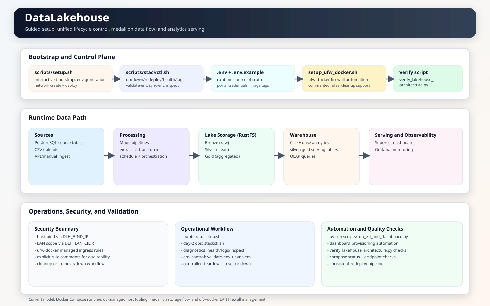

# Hệ thống Modern Data Lakehouse (Local-First)

Hệ thống **Data Lakehouse** hoàn chỉnh phục vụ lưu trữ, xử lý và phân tích dữ liệu tập trung, được thiết kế và đóng gói chạy local thông qua Docker Compose. Dự án áp dụng kiến trúc Medallion (Bronze → Silver → Gold), tích hợp luồng dữ liệu thời gian thực (CDC) và luồng tải tệp định kỳ (Batch ETL) để phục vụ báo cáo và phân tích BI hiệu năng cao.



---

## 1. Thành phần của Stack Công nghệ

| Phân lớp | Công nghệ | Vai trò trong hệ thống |
| :--- | :--- | :--- |
| **Ingest (Thời gian thực)** | Redpanda Connect (Go) | Thu thập dữ liệu CDC siêu nhẹ từ PostgreSQL sang Redpanda và ClickHouse |
| **Ingest (Theo lô/Tệp)** | Upload Portal (Flask), Watcher | Cổng tải tệp Excel/CSV cho nhân sự và cơ chế tự động theo dõi sự kiện tệp mới |
| **Event Broker** | Redpanda (v26.1.7) | Hệ thống hàng đợi tương thích Kafka, hỗ trợ lưu trữ dài hạn (Tiered Storage) lên Lake |
| **Storage (Data Lake)** | RustFS (S3-compatible) | Lưu trữ phân tầng Medallion (Bronze/Silver/Gold) dưới định dạng tệp Parquet |
| **Process (ETL)** | Mage.ai & dbt | Điều phối tiến trình làm sạch dữ liệu batch và biến đổi dbt models |
| **Warehouse (OLAP)** | ClickHouse | Động cơ cơ sở dữ liệu dạng cột (Columnar OLAP) cho phân tích hiệu năng cao |
| **Dashboards (BI)** | Apache Superset | Giao diện trực quan hóa dữ liệu và xây dựng báo cáo BI |
| **Monitoring** | Grafana & Prometheus | Giám sát trạng thái hoạt động của server và tiến trình ETL |
| **Cache & Queue** | Redis 8 | Hệ thống cache kết quả Superset và phân phối hàng đợi |
| **GUI SQL IDE** | CloudBeaver | Trình duyệt quản trị SQL trực tiếp trên web |
| **Reverse Proxy** | Zoraxy | Điều phối tên miền và định tuyến dịch vụ ngoài docker |

---

## 2. Danh sách dịch vụ và Cổng kết nối (Ports)

| Dịch vụ | Tên Container | Cổng kết nối mặc định | Thông tin đăng nhập |
| :--- | :--- | :--- | :--- |
| **Upload Portal** | `dlh-upload-portal` | `28000` | Quản trị bằng tài khoản cấp trong PostgreSQL |
| **Redpanda Console** | `dlh-redpanda-console` | `29080` | Không yêu cầu xác thực mặc định |
| **RustFS Console** | `dlh-rustfs` | `29101` | `RUSTFS_ACCESS_KEY` / `RUSTFS_SECRET_KEY` |
| **Mage UI** | `dlh-mage` | `26789` | `MAGE_DEFAULT_OWNER_USERNAME` / `MAGE_DEFAULT_OWNER_PASSWORD` |
| **Superset UI** | `dlh-superset` | `28088` | `SUPERSET_ADMIN_USER` / `SUPERSET_ADMIN_PASSWORD` |
| **Grafana UI** | `dlh-grafana` | `23001` | `GRAFANA_ADMIN_USER` / `GRAFANA_ADMIN_PASSWORD` |
| **CloudBeaver IDE** | `dlh-cloudbeaver` | `28978` | Cấu hình trong lần đăng nhập đầu tiên |
| **Redis Insight** | `dlh-redis-insight` | `25540` | Kết nối tới `dlh-redis:6379` bằng `REDIS_PASSWORD` |
| **PostgreSQL DB** | `dlh-postgres` | `25432` | `POSTGRES_USER` / `POSTGRES_PASSWORD` |
| **ClickHouse HTTP** | `dlh-clickhouse` | `28123` | `CLICKHOUSE_USER` / `CLICKHOUSE_PASSWORD` |

---

## 3. Khởi động nhanh (Quick Start)

### Yêu cầu hệ thống
* Hệ điều hành: Linux (Ubuntu/Debian khuyến nghị) hoặc WSL2 trên Windows.
* Docker Engine + Docker Compose plugin.
* Trình quản lý thư viện Python [**`uv`**](https://github.com/astral-sh/uv) cài đặt sẵn trên máy Host.

### Bước 1: Đồng bộ mã nguồn và thư viện
```bash
git clone https://github.com/vuhuudo/DataLakehouse.git
cd DataLakehouse
uv sync --all-groups
```

### Bước 2: Thiết lập hệ thống (Guided Setup)
Chạy script thiết lập tương tác để kiểm tra xung đột cổng, sinh file cấu hình `.env` bảo mật và khởi chạy toàn bộ container:
```bash
bash scripts/setup.sh
```

### Bước 3: Kiểm tra sức khỏe hệ thống
Kiểm tra xem toàn bộ các thành phần dịch vụ đã khởi động và hoạt động ổn định chưa:
```bash
bash scripts/stackctl.sh health       # Kiểm tra kết nối sâu
bash scripts/stackctl.sh diagnose     # Chẩn đoán xung đột cổng và lỗi logs
```

---

## 4. Cổng Tải dữ liệu (Upload Portal) & Quản lý Người dùng

Để phục vụ nhu cầu nghiệp vụ của các nhân viên không có kiến thức kỹ thuật, hệ thống tích hợp dịch vụ **Upload Portal** (được viết bằng Flask tại thư mục `/portal` và chạy tại cổng `28000`).

### Các tính năng cốt lõi:
* **Phân quyền và bảo mật:**
  * Toàn bộ thông tin tài khoản được lưu trữ mã hóa (sử dụng mật khẩu băm pbkdf2:sha256) trong bảng `portal_users` trên PostgreSQL.
  * Chỉ tài khoản có quyền `admin` mới được truy cập các tính năng quản trị người dùng và kích hoạt thủ công tiến trình ETL. Nhân sự thông thường (`staff`) chỉ có quyền upload tệp và xem lịch sử tải lên.
* **Quy trình Đổi mật khẩu bắt buộc:** Khi Admin tạo một tài khoản mới, tài khoản đó sẽ bị bắt buộc phải tự đổi mật khẩu ngay lần đầu tiên đăng nhập để bảo mật thông tin.
* **Tải lên nhiều tệp (Multi-file upload):** Hỗ trợ kéo thả và chọn đồng thời nhiều tệp `.csv` hoặc `.xlsx` tải lên S3 Bronze bucket.
* **Xóa tệp chờ xử lý:** Cho phép chọn và xóa các tệp đã tải lên khỏi S3 Bronze bucket để quản lý không gian lưu trữ trước khi hệ thống chạy tổng hợp.
* **Cơ chế Quên mật khẩu an toàn:** Khi nhân sự bấm quên mật khẩu, hệ thống sẽ tự sinh mã OTP gồm 6 chữ số ghi trực tiếp vào container logs của Portal để IT/Admin có thể lấy và cấp lại/reset mật khẩu cho người dùng.

---

## 5. Múi giờ hoạt động và Xử lý tệp Excel

### Đồng bộ giờ Việt Nam (`Asia/Ho_Chi_Minh`)
* Toàn bộ hệ thống chạy đồng bộ theo giờ Việt Nam. Các server ClickHouse, PostgreSQL và múi giờ hệ thống của Docker containers đều cấu hình mặc định là `Asia/Ho_Chi_Minh`.
* Thời gian sửa đổi file trên S3 và thời gian thực thi ETL hiển thị trên Cổng Tải lên đều đã được định dạng và chuyển đổi chính xác từ UTC sang GMT+7 trước khi hiển thị cho người dùng.

### Đảm bảo không bị nuốt dữ liệu khi Upload Excel tùy chỉnh
Bảng đích lưu trữ kết quả Excel trong ClickHouse (`analytics.project_reports`) được thiết kế theo cấu trúc `ReplacingMergeTree` sắp xếp theo khóa `(_source_file_key, Mã công việc (ID))`.
* **Cơ chế cũ:** Nếu người dùng upload các tệp Excel không có cột `Mã công việc (ID)` (như danh sách nhân sự hay bảng chấm công), Clickhouse sẽ gán ID mặc định là rỗng `""`. Điều này làm Clickhouse hiểu nhầm toàn bộ các dòng trong tệp là trùng lặp và gộp (collapse) lại chỉ giữ lại **duy nhất 1 dòng**.
* **Cơ chế mới (Đã sửa đổi):** Khi tệp Excel được nạp vào, block `clean_excel_data` của Mage sẽ tự động kiểm tra sự tồn tại của cột `Mã công việc (ID)`. Nếu tệp tải lên không có cột này, hệ thống sẽ **tự động sinh mã dòng tuần tự** (`ROW_1`, `ROW_2`,...) gắn theo tệp nguồn. Cơ chế này đảm bảo mọi bản ghi của bất kỳ tệp Excel nào tải lên cũng có định danh duy nhất, **không bao giờ bị mất mát dữ liệu** khi nạp vào ClickHouse, đồng thời bảng `project_reports` cũng tự động tiến hóa schema (Evolve schema) để bổ sung thêm các cột mới có trong tệp Excel của bạn.

---

## 6. Lệnh điều phối vòng đời hệ thống (Day-2 Ops)

Mọi thao tác quản trị vòng đời ứng dụng đều được thực hiện thông qua script `scripts/stackctl.sh`:

* **Khởi động và Dừng hệ thống:**
  ```bash
  bash scripts/stackctl.sh up             # Khởi chạy stack compose
  bash scripts/stackctl.sh down           # Dừng stack compose (giữ lại dữ liệu)
  ```
* **Triển khai lại và cập nhật:**
  ```bash
  bash scripts/stackctl.sh redeploy       # Kéo image mới và dựng lại các container
  bash scripts/stackctl.sh redeploy --safe # Triển khai lại có backup dữ liệu trước
  ```
* **Sao lưu và Khôi phục nhanh:**
  Dùng các script đóng gói toàn bộ mã nguồn và dữ liệu docker volumes để lưu trữ phòng ngừa thảm họa:
  ```bash
  bash scripts/backup.sh                  # Tự động dừng stack và đóng gói file .tar.gz
  bash scripts/restore.sh /đường/dẫn/file_backup.tar.gz # Khôi phục dữ liệu
  ```
* **Reset sạch dữ liệu:**
  ```bash
  bash scripts/stackctl.sh reset --hard   # Xóa sạch toàn bộ docker volumes (Xóa DB/Lake)
  ```

---

## 7. Báo cáo kiểm tra Bảo mật thông tin (Security Audit)

Trước khi đẩy mã nguồn dự án lên GitHub, hãy chú ý các điểm kiểm tra an toàn thông tin sau:

1. **Tệp cấu hình môi trường `.env`:**
   * Tệp `.env` chứa mật khẩu kết nối cơ sở dữ liệu (`HoancauIT2026`), access key của S3, và mã bí mật Superset.
   * **Trạng thái:** Tệp `.env` hiện tại đã được liệt kê trong `.gitignore` (dòng 147) và **KHÔNG** bị theo dõi (untracked) trong commit hiện tại.
2. **Lịch sử Git (Git History):**
   * **CẢNH BÁO:** Kiểm tra lịch sử commit cho thấy tệp `.env` **đã từng bị commit nhầm** trong quá khứ tại các commit cũ (như commit `f9c87a6` và `b31cae5`) trước khi nó bị loại bỏ khỏi version control ở commit `75047c3`.
   * **Khuyến nghị bảo mật:** Nếu bạn muốn đưa kho chứa mã nguồn này lên một GitHub repository **Công khai (Public)**, các mật khẩu trong quá khứ vẫn có thể bị người khác tìm thấy thông qua lịch sử Git. Bạn nên:
     * **Cách 1 (Khuyến nghị):** Thay đổi toàn bộ mật khẩu kết nối trong `.env` trên môi trường production khác với mật khẩu đang có trong lịch sử git.
     * **Cách 2:** Sử dụng công cụ `git-filter-repo` hoặc `BFG Repo-Cleaner` để quét sạch lịch sử commit của tệp `.env` trước khi push lên github:
       ```bash
       pip install git-filter-repo
       git filter-repo --path .env --invert-paths
       ```
3. **Mã nguồn ứng dụng và Cổng Portal (`/portal`):**
   * Mã nguồn ứng dụng Cổng Portal hoàn toàn không chứa bất kỳ khóa API bí mật hoặc thông tin mật khẩu cứng (hardcoded credentials). Mọi giá trị mật khẩu kết nối đều được Portal đọc động từ biến môi trường (`os.getenv`), đảm bảo tuân thủ tiêu chuẩn an toàn bảo mật 12-factor app.

---

## 8. Giấy phép

Dự án phát hành dưới giấy phép mã nguồn mở **MIT License**.
